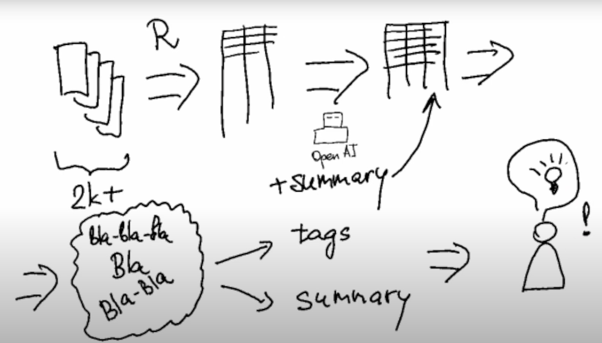
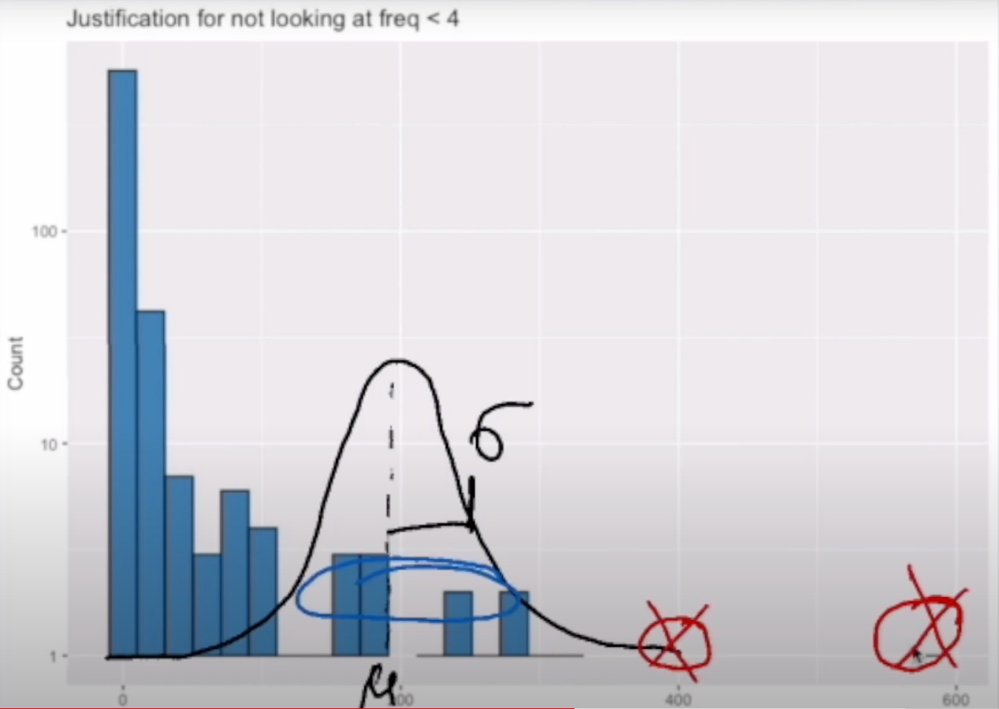
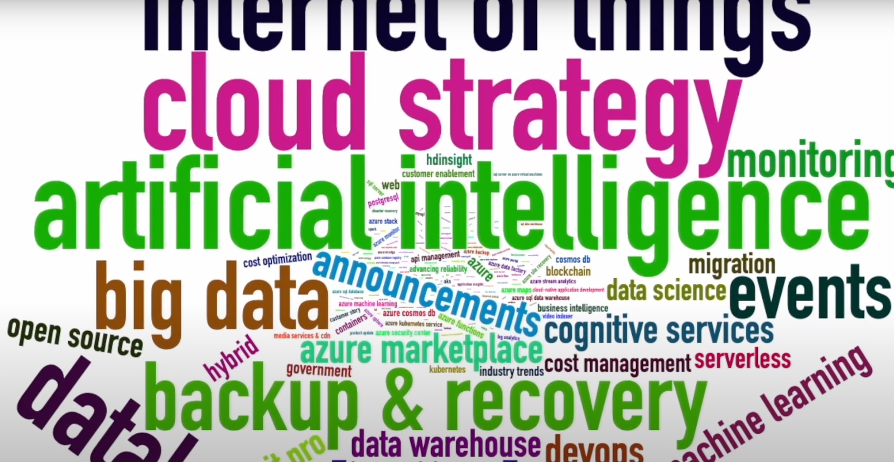

# Azure blog analysis with R and OpenAI

## Summary
The article describes a method for efficiently going through a large number of blog posts and identifying the ones that are relevant to the reader's interests. The method involves using Open AI to augment data by summarizing blog posts. Then, by reviewing word clouds, one can quickly identify which posts to read manually to obtain the most relevant information.

See episode on [Youtube](https://youtu.be/ttaK3fjynV4)

## Table of Contents

- [Summary](#summary)
- [Overview](#overview)
- [Analysis](#analysis)
  - [Data extraction and augmentation](#data-extraction-and-augmentation)
  - [Data analysis](#data-analysis)
    - [Tags frequency](#tags-frequency)
    - [Words clouds: Tags and OpenAI summary](#words-clouds-tags-and-openai-summary)
    - [Manual review](#manual-review)
- [Conclusion](#conclusion)

## Overview

Analyzing a large number of blog posts can be a daunting task, especially when the titles may not clearly indicate what the blog post is about. Fortunately, with the help of generative AI, such as Chat GPT or Open AI, this task can be made easier. In this blog post, we will walk you through the process of parsing the Microsoft blog, extracting all tags and blog post titles, summarizing each blog post using Open AI, and identifying the most important areas of focus for our project using a word cloud.

## Analysis

### Data extraction and augmentation
The [first step](01-parse.R) in analyzing a large number of blog posts is to extract all relevant data from the page. To do this, we first extract each blog post link from the page and then unpack all data and additional data using a function called "extract text data." We then collect all blog post data into an array and use this to analyze the page. This involves reading in HTML and using an API key to access Open AI's summarization service. We create a request to Open AI and wait for a response, which we then convert to JSON and strip of any unnecessary content.

We also extract additional data from the blog post, such as blog box text, labels, and the blog post title, which we return for each post. Overall, our "block data dot all" array contains all data for all blog posts, including the ID, labels, summary generated using Open AI, blog post title, and URL.

### Data analysis
#### Tags friquency
Once we have extracted all relevant data, we can then begin to analyze the data. We start by reviewing the years, months, and post pages these blog posts were found on. Next, we examine the different tags available in our posts and how frequently they appear. For each tag, we want to see its frequency distribution, which we plot on a logarithmic scale. To ensure that the focus is not on tags that appear only once or twice, we consider only those tags that appear four or more times.

To manage the distribution, we apply a Gaussian distribution formula with a central part (mu) of the distribution at around 200 appearances and a width (sigma) of 0 to 400 so that less frequent tags do not distract us. After performing these analyses, we can build the word cloud, which represents the blog post labels or tags, such as "artificial intelligence" or "cognitive services." From this word cloud, we can identify the focus tags, such as "cloud strategy" and "Internet of Things," in which we are interested.

#### Words clouds: Tags and OpenAI summary
Next, we [build](02-explore-blog.R) a list of interesting tags and filter out the blog posts that contain only those tags. We then summarize the tokens (i.e., the words present in the services summary), but filter out common words like "Asure," "Microsoft," and "cloud" using a custom list of stop words. After filtering out stop words, we create a new summary that highlights relevant terms related to cloud strategy and IoT. Some prominent terms include "edge," "data management," "cost," "migration," "security," "AI," and "central." We save this data and generate two files: the first lists the 200 blog articles that contain tags related to cloud strategy and IoT, and the second lists the summary of those blog posts with the relevant keywords.

#### Manual review
We can now review the blog post titles and mark a few that may be of interest. We can then apply colors to these marked titles. We now only have a few blocks to read through manually, which we can do by clicking on the links. 

## Conclusion
This is how you can condense 2500 articles down to a handful of ones that you must read manually to obtain the information that you need.

I hope you enjoyed the material and appreciate the effort that went into its production. Please let me know your thoughts.
